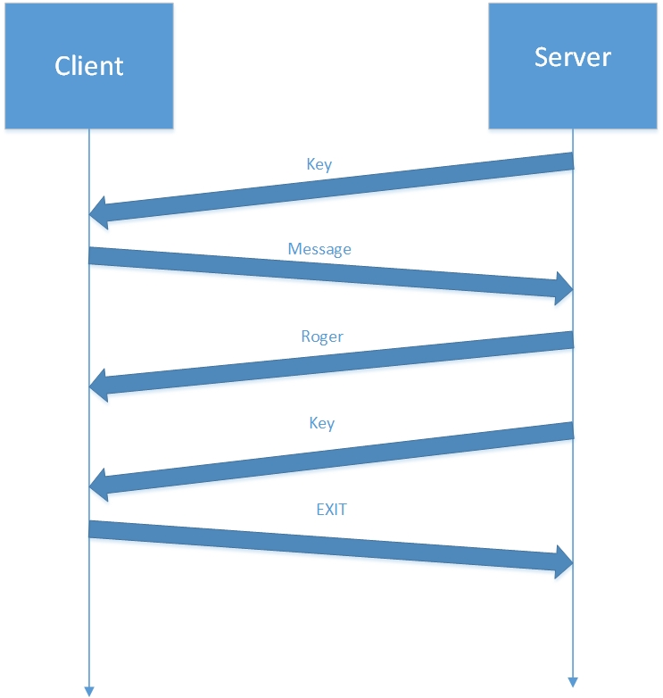

# Teaching-HEIGVD-RES-2016-Labo-Caesar

## Note sur notre labo :

Concernant notre cryptage caesar, nous avons décidé d'utiliser un décalage compris entre 10 et 30, afin de ne pas sortir de la table ascii étendue. Nous n'utilison donc pas de cyclicitée.

Le principe de fonctionnement est le suivant :
* Le client se connecte et reçoit une clé pour son prochain message.
* Le client envoit son message crypter au serveur, qui répond par un message non crypté contenant "roger".
* Le serveur renvoit une clé pour le prochain message du client.
* Le client termine la connexion avec le mot "EXIT", le serveur en recevant se message termine également la connexion de son côté.

